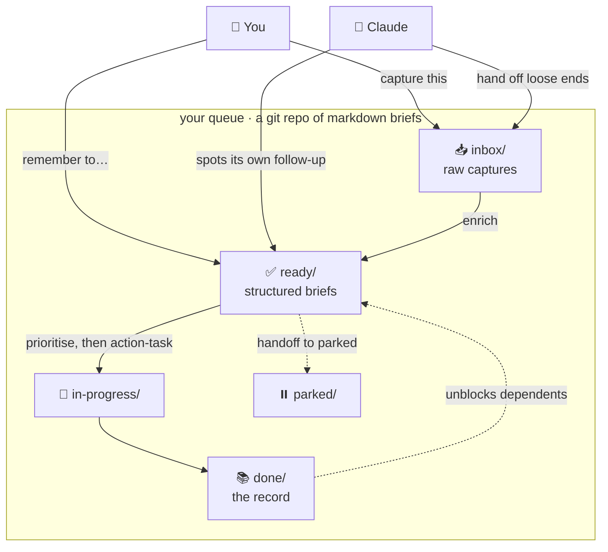

# claude-tasks

A **git-backed task queue that Claude can capture into, structure, see, execute, and hand
off.** Each task is a self-contained markdown *brief* — rich enough that an agent can act
on it with zero prior context.

Installed as a [Claude Code](https://claude.com/claude-code) plugin. Your queue is a plain
git repo of markdown files: greppable, diffable, syncable, and yours.

> Status: **v1**. The core capture → structure → see → execute → hand-off loop is here,
> fully tested. See [Roadmap](#roadmap) for what's deliberately deferred.

## How it works

Two actors, one queue: you drop ideas in, Claude works the ones it can and hands its loose
ends back. Everything is plain markdown moving between folders:



A brief only moves forward when it's earned it: raw notes get **enriched** into briefs,
the **prioritiser** picks the highest-leverage *unblocked* brief, **action-task** runs it,
and finished briefs stay in `done/` as the record — where they can **unblock** whatever was
waiting on them. A concrete run-through is in [A worked example](#a-worked-example) below.

## Why briefs, not to-dos

Most task tools store a title and a due date — too thin for an agent to act on. The unit
here is a **brief**:

- **Goal** — the desired end state ("X exists / Y is true"), not "do X".
- **Context** — everything a zero-context agent needs: repos, paths, links, why.
- **Success criteria** — the checkable contract for "done".
- plus constraints, notes, and an execution log.

Two actors share one queue: you drop ideas in; Claude captures its own follow-ups,
enriches raw notes into briefs, executes the ones it can do end-to-end, and hands a
session's loose ends back when it stops.

## Install

```
/plugin marketplace add <owner>/claude-tasks
/plugin install claude-tasks
```

(Or point your plugin config at this repo.) Then create your queue:

```
/tasks-init ~/tasks --name "My Queue"
```

That scaffolds the lifecycle folders, a `tasks.toml`, and a brief template, and tells you
how the scripts will find it.

## The loop

| You say… | Skill | What happens |
|---|---|---|
| "remember to…" / Claude spots a follow-up | **queue-task** | a full brief is minted |
| "capture this" (mid-flow) | **raw-capture** | a raw note lands in `inbox/` |
| "enrich the inbox" | **enrich** | raw notes become structured briefs |
| "what's next?" / `/tasks-next` | **prioritise** | ranks the queue (dependency-aware) |
| "action the X task" | **action-task** | Claude executes a brief end-to-end |
| "show the board" / `/tasks-board` | — | regenerates `view/board.html` |
| "I'm done, hand off" | **handoff** | the session's open work flows to the queue |
| "recap" | **recap** | a quick in-chat status summary |

### Priorities and dependencies

`prioritise` (the `/tasks-next` command) ranks `ready/` briefs by due urgency, importance,
quick-win effort, lead time, and — crucially — how many other briefs each one **unblocks**.
Dependencies are declared with `blockers: [other-id]` or a `depends:<id>` tag, and a brief
stays blocked until its dependency reaches `done/`, so the queue self-unblocks as work
lands. Define your own priority-tag weights (e.g. an `urgent`/`frog` convention) under
`[priority]` in `tasks.toml`; the base ranking is otherwise purely mechanical.

## A worked example

Say you're mid-way through a code review and notice the public API has no rate limiting.
You don't want to lose the thought, but you don't want to stop either:

> **You:** capture this — the public API has no rate limiting

`raw-capture` drops a one-line note in `inbox/` and you carry on. Later you clear the inbox:

> **You:** enrich the inbox

`enrich` turns that note into a full brief in `ready/`:

```markdown
---
id: add-rate-limiting-to-public-api
title: Add rate limiting to the public API
status: ready
type: todo
importance: 2
autonomy: full
due: 2026-07-01
blockers: [choose-rate-limit-store]
tags: [security, depends:choose-rate-limit-store]
---

## Goal
The public API rejects abusive traffic: each client is capped at N requests/minute
and over-limit requests get a clear 429.

## Context
`api/routes/*` currently have no throttle. We need a shared counter store first —
tracked by the `choose-rate-limit-store` brief.

## Success criteria
- [ ] Over-limit requests return 429 with a `Retry-After` header
- [ ] The limit is configurable per route
- [ ] Covered by tests
```

Then you ask what to pick up next:

> **You:** what's next?  *(or `/tasks-next`)*

`prioritise` ranks `ready/` — but this brief is **held back**, because its blocker
`choose-rate-limit-store` isn't in `done/` yet. The prioritiser is dependency-aware, so it
surfaces the store-choice brief instead. Once that lands in `done/`, the rate-limiting brief
**self-unblocks** and rises to the top (a security item near its due date). Now:

> **You:** action the rate-limiting task

`action-task` moves it to `in-progress/`, Claude works it end-to-end against the success
criteria, and it finishes in `done/` — where it stays as the record, and where its
completion is what unblocked anything waiting on *it*.

## The queue

```
inbox/        raw, un-enriched captures (pre-briefs)
ready/        enriched, executable briefs
in-progress/  briefs being worked
done/         completed briefs (kept — they are the record)
parked/       suspended briefs
view/         generated board.html (read-only; never hand-edited)
tasks.toml    per-queue config (name, domains, timezone)
_template.md  the brief schema
```

A brief's `status:` always matches its folder. The board is a *view*, regenerated from the
briefs — the briefs are the source of truth.

### Where the queue lives (root resolution)

The scripts ship in the plugin; your queue is your data, elsewhere. The root is resolved
in order:

1. `$CLAUDE_TASKS_DIR`, if set — a global personal queue.
2. The nearest ancestor `.tasks/` directory (walk up, like git's `.git`) — project-scoped
   queues you can check into a repo.
3. `~/tasks` — the default.

## Configuration

Everything user-specific is a *value*, not code. `tasks.toml` at the queue root:

```toml
name = "My Queue"           # shown in the board title
domains = ["work", "home"]  # the allowed set for a brief's `domain:`
timezone = "UTC"
```

The engine (scripts, skills, board) is identical for everyone; only the config differs.

## Quality

Every change is gated in CI, blocking:

- **ruff** — lint
- **mypy --strict** — full static typing
- **pytest** with a **100%-coverage gate** on our own code
- **mutmut** — mutation testing on the resolution/config core (zero surviving mutants)

Line coverage proves code ran; mutation score proves the tests actually assert behaviour.

## Roadmap

Deliberately not in v1, designed to bolt on without changing the engine:

- **SessionEnd auto-capture** — a deterministic hook that parses the session transcript
  for open Task-API/TodoWrite items and files them (idempotent via a marker). Today the
  `handoff` skill does this model-driven, on demand.
- **session-browser** — browse/resume recent sessions; render one session as a board.
- **Leverage prioritisation** — the generic, mechanical prioritiser ships in v1
  (`prioritise`); a richer whole-estate ranking by a configurable leverage score
  (emotional weight × reduces-load × urgency × compounding) is the deferred personal variant.
- **External routing** — push real-world tasks to another task system.
- **Autonomous worker** — a scheduled loop that drains the `autonomy: full` queue.

## License

MIT — see [LICENSE](LICENSE).
